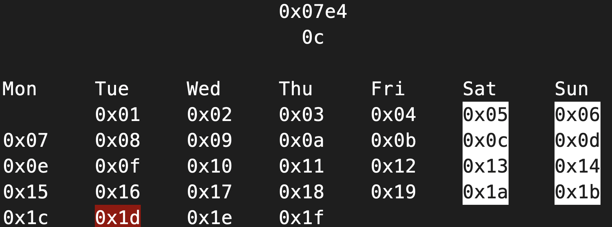
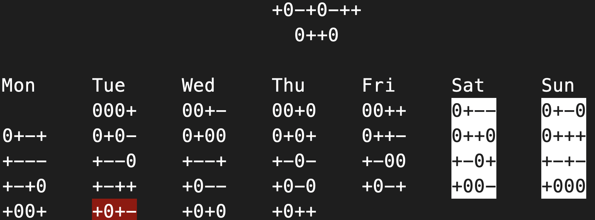

[](https://crates.io/crates/hcal)

# hcal

A programmer's calendar for terminal

## Installation

`cargo install hcal`

## Examples





## Usage

```console
> hcal --help
A programmer's calendar

USAGE:
    hcal [FLAGS] [OPTIONS] [ARGS]

ARGS:
    <year>     Sets the year
    <month>    Sets the month
    <day>      Sets the day

FLAGS:
    -b, --balanced-ternary    Use balanced ternary representation
    -d, --disable             Disable day marker
    -A, --disbale-all         Disable all font effects
    -E, --effect              Enable title font effects
    -h, --help                Prints help information
    -W, --no-weekend          Disable weekend marker
    -V, --version             Prints version information

OPTIONS:
    -e, --easter <year>       Prints the Hex Date of easter.
    -T, --transform <date>    Prints the Hex Date of <date>. Needs format of dd-mm-yyyy.
```

[](https://asciinema.org/a/381223)
